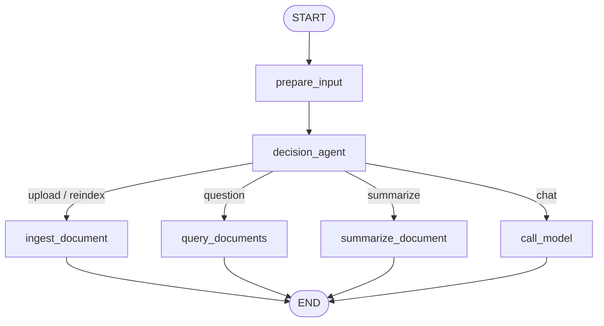

# Arabic Document Intelligence Agent

**وثيقة (Wathiqa)** — LangGraph agent for Arabic document OCR, indexing, and grounded RAG with citations.

Upload Arabic PDFs (digital or scanned), images, text files, and Word (.docx) documents; extract text with a modular OCR engine when needed; index with multilingual embeddings; and answer questions in Arabic or English — only from retrieved evidence, with page citations.

| | |
|---|---|
| **Author** | Muhammad Qasim Shabbir |
| **Email** | [muhammadqasimshabbir3@gmail.com](mailto:muhammadqasimshabbir3@gmail.com) |
| **Version** | 0.2.0 |
| **License** | MIT |

---


## What It Does

```text
User Upload
  → Document Loader (PDF / images / TXT·MD·CSV / DOCX)
  → Digital text fast-path OR Arabic OCR (Qari)
  → Arabic normalization
  → Chunking (page-aware / recursive / layout-aware)
  → BGE-M3 embeddings
  → Vector store (Chroma default)
  → Hybrid retrieve (semantic + BM25)
  → Trust-layer read of top passages
  → Grounded answer + Sources (filename + page)
```

### Design principles

1. **Preserve engineering, replace domain.** LangGraph routing, state, logging, Docker, and UI plumbing were kept from the prior Andromeda agent; commerce/Gmail/SQL tools were removed.
2. **OCR behind an interface.** Downstream code calls `ocr_engine.extract(document)` — swap Qari / AIN / digital via config.
3. **Ground always, cite always.** Answers come only from retrieved passages; insufficient evidence is stated explicitly.
4. **Language follows the user.** Arabic questions → Arabic answers; English → English; quotes stay in the source language.

---

## Tech Stack

| Layer | Technology |
|-------|------------|
| Orchestration | LangGraph `StateGraph` |
| LLM | Groq (`llama-3.1-8b-instant`) via provider-agnostic factory |
| OCR (default) | **Qari-OCR v0.3** (`NAMAA-Space/Qari-OCR-v0.3-VL-2B-Instruct`) |
| Digital PDF text | `pypdf` (skips OCR when a text layer exists) |
| Embeddings | **BAAI/bge-m3** (Arabic + English, 1024-d) |
| Vector store | **Chroma** (Apache-2.0), persistent under `data/chroma`; FAISS optional |
| Chunking | page-aware / recursive / layout-aware / **semantic** |
| Reranker | Optional lexical or cross-encoder (`ENABLE_RERANKER=true`) |
| Frontend | React 19 + Vite + LangGraph SDK |
| Package manager | `uv` |

### Where data lives

| Concern | Free open-source choice | Default location |
|---------|-------------------------|------------------|
| Vector database | [Chroma](https://github.com/chroma-core/chroma) | `data/chroma` (`VECTORSTORE_PERSIST_DIR`) |
| Embedding weights | [BAAI/bge-m3](https://huggingface.co/BAAI/bge-m3) | `models/bge-m3` |
| OCR weights | [Qari-OCR v0.3](https://huggingface.co/NAMAA-Space/Qari-OCR-v0.3-VL-2B-Instruct) | `models/NAMAA-Space__Qari-OCR-…` |
| Sample Arabic PDF | MIT sample circular (in-repo generator) | `data/samples/arabic_admin_circular.pdf` |

### Why these models

**OCR — Qari-OCR v0.3:** Real local Arabic-specialized Qwen2-VL fine-tune (~2B), layout-aware, strong printed-Arabic CER. Classical engines (PaddleOCR, Surya, EasyOCR, Tesseract) score poorly on [KITAB-Bench](https://github.com/mbzuai-oryx/KITAB-Bench). Digital PDFs with a text layer skip OCR via `pypdf`. AIN-7B / other VLMs remain optional via `OCR_ENGINE` / `OCR_MODEL_ID`.

**Embeddings — BGE-M3:** Multilingual dense retrieval, MIT, sentence-transformers compatible, strong Arabic↔English cross-lingual queries.

**Vector DB — Chroma:** Free open-source embedding database; persists on disk at `data/chroma` by default.

**Vector DB — Qdrant (production):** Set `VECTORSTORE_BACKEND=qdrant`, install `uv sync --extra qdrant`, and point `QDRANT_URL` at your instance (local Docker or Qdrant Cloud). Share credentials via `.env` — never commit them.

---

## Agent Graph

```text
START → prepare_input → decision_agent
          ├── ingest_document      load → OCR → chunk → embed → index (+ summary)
          ├── query_documents      retrieve → trust layer → grounded answer + Sources
          ├── summarize_document   index + summary
          └── call_model           general chat (no invented doc facts)
```



---

## Repository Layout

```text
src/
  agent/           # LangGraph entry (graph.py) + document_qa
  config/          # Settings from environment
  state/           # AgentState
  routing/         # Intent + language detection
  loaders/         # PDF / image / text / DOCX loaders
  ocr/             # OCREngine + Qari + digital_text
  preprocess/      # Arabic Unicode normalization
  chunking/        # recursive / page_aware / layout_aware
  embeddings/      # BGE-M3 embedder
  vectorstore/     # Chroma (+ pluggable backends)
  retriever/       # Semantic + hybrid retrieval
  reranker/        # lexical or cross-encoder rerank
  llm/             # Provider factory (Groq default)
  prompts/         # Grounded QA + trust-layer prompts
  utils/           # async + logging
frontend/          # Vite React dashboard
scripts/           # download_embedding_model.py, download_ocr_model.py
tests/
```

---

## Prerequisites

- Python 3.11 or 3.12
- `uv`
- Groq API key
- Node.js + npm (React UI)
- GPU recommended for Qari OCR (CPU works, slower)
- Disk space for BGE-M3 (~2 GB) and Qari (~4–5 GB)

---

## Environment

```bash
cp .env.example .env
```

| Variable | Required | Purpose |
|----------|----------|---------|
| `GROQ_API_KEY` | Yes | Chat LLM |
| `GROQ_MODEL` | No | Default `llama-3.1-8b-instant` |
| `OCR_ENGINE` | No | `qari` (default) \| `ain` \| `digital` |
| `OCR_MODEL_ID` | No | Hugging Face model id |
| `EMBEDDING_MODEL_ID` | No | Default `BAAI/bge-m3` |
| `CHUNK_STRATEGY` | No | `page_aware` \| `recursive` \| `layout_aware` \| `semantic` |
| `VECTORSTORE_BACKEND` | No | `chroma` (local disk) \| `faiss` \| `qdrant` (production) |
| `VECTORSTORE_PERSIST_DIR` | No | Chroma path (`data/chroma`); use `memory` for ephemeral |
| `QDRANT_URL` | No | When using Qdrant — e.g. `http://localhost:6333` or cloud URL |
| `QDRANT_API_KEY` | No | Qdrant Cloud / secured instance API key |
| `RETRIEVAL_MODE` | No | `hybrid` \| `semantic` |
| `RETRIEVAL_TOP_K` | No | Default `5` |
| `ENABLE_RERANKER` | No | `true` to enable post-retrieval rerank |
| `RERANKER_BACKEND` | No | `lexical` (default) \| `cross_encoder` |
| `LLM_PROVIDER` | No | `groq` \| `openai` \| `ollama` \| `gemini` |

---

## Installation

```bash
cp .env.example .env
# edit GROQ_API_KEY

chmod +x setup.sh start.sh
./setup.sh

# Optional: prefetch models
uv run python scripts/download_embedding_model.py
uv run python scripts/download_ocr_model.py   # large; only needed for scanned docs

# Seed a free Arabic sample into the real Chroma DB and test retrieval
uv run python scripts/seed_arabic_sample.py
uv run python scripts/seed_arabic_sample.py --answer --ask "ما مدة الإجازة السنوية؟"

# Seed a free Arabic book from Gutendex into Qdrant
uv sync --extra qdrant
uv run python scripts/seed_free_arabic_book_qdrant.py --answer
```

After seeding, ask questions **directly in chat** (no PDF upload required). The decision agent routes to a READ-only query planner, then hybrid BM25 + vector retrieval against `KNOWLEDGE_COLLECTION`, and the LLM answers from retrieved evidence.

```bash
# Ensure KNOWLEDGE_COLLECTION=wathiqa_knowledge in .env
# Then ask in the UI, e.g. "ما موضوع ألف ليلة وليلة؟"
```

Manual:

```bash
uv venv .venv
uv sync
```

---

## Run

```bash
# LangGraph API (port 2024)
./start.sh api

# React UI (port 5173)
./start.sh frontend

# Both
./start.sh both

# Streamlit alternative
streamlit run streamlit_ui.py
```

LangGraph Studio: `langgraph dev`

Upload `data/samples/arabic_admin_circular.pdf` in the UI (generated by the seed script) and ask in Arabic or English.

---

## Testing

```bash
uv run pytest tests/unit_tests -q
```

Integration / live LLM tests are marked `langsmith` / `integration`.

---
## UI
ui_images/Screenshot from 2026-07-27 14-14-18.png
ui_images/Screenshot from 2026-07-27 15-55-25.png
ui_images/Screenshot from 2026-07-27 15-57-40.png
ui_images/Screenshot from 2026-07-27 17-56-47.png
ui_images/Screenshot from 2026-07-28 13-39-26.png

## Deployment

- **Backend:** `Dockerfile` + `railway.json` (LangGraph API)
- **Frontend:** `frontend/vercel.json` / root `vercel.json`
- Graph entry remains `./src/agent/graph.py:graph` in `langgraph.json`

---

## Evolution note

This project evolved from the Andromeda multi-tool agent. Reused: LangGraph graph patterns, grounding/citation UX, Chroma indexing, embedding download script, React streaming UI, Docker/CI layout. Removed: Gmail, store SQL, business RAG, calculator, web/file search, location, PDF report generation.
